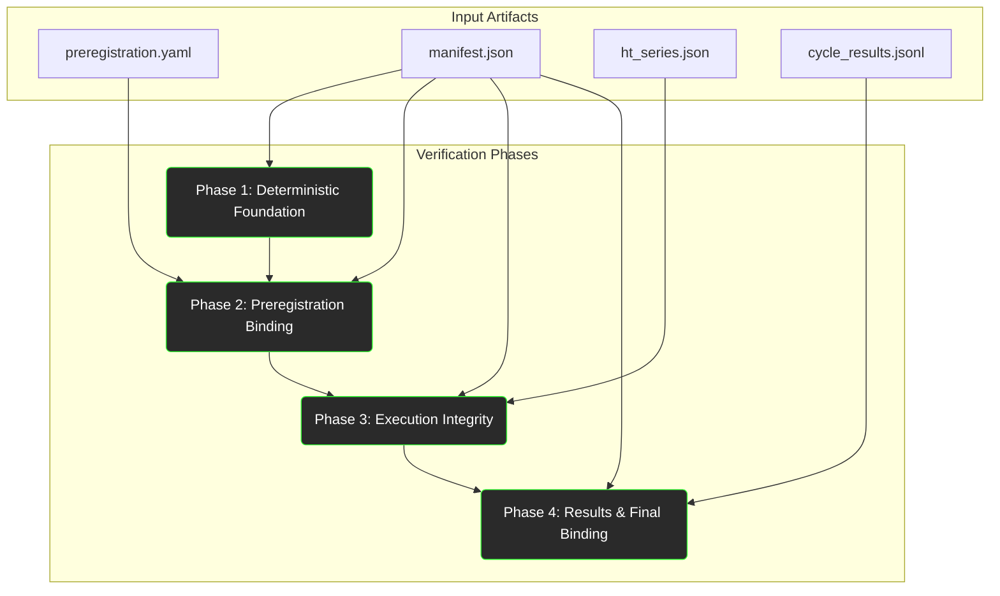

# HT-Series Invariant Implementation Plan

**Document Version:** 1.0
**Author:** Gemini L, Hₜ-Series Invariant Implementation Engineer
**Target Specification:** `HT_INVARIANT_SPEC_v1.3.md`

## 1.0 Overview and Objective

This document provides a complete implementation and testing blueprint for the Hₜ-series invariants as defined in the specification. Its objective is to translate the specification into an actionable engineering plan, ensuring that all cryptographic and deterministic guarantees are correctly implemented and verified.

The core of this plan is a phased, test-driven approach. We will build the verification suite from the ground up, starting with the most foundational deterministic guarantees and layering additional checks on top, mirroring the logical dependency of the invariants themselves.

## 2.0 Dependency Graph of Invariant Verification

The verification of the Hₜ-series invariants is not monolithic; it is a composition of dependent checks. The following graph illustrates the required order of verification. One cannot, for example, verify the final `Hₜ-MDAP Binding` until both the `Hₜ Chain` and the `MDAP Attestation` have been independently verified.

*   **Phase 1 (Deterministic Foundation):** Verifies the MDAP seed schedule. This is the root of trust for all deterministic processes.
*   **Phase 2 (Preregistration Binding):** Verifies that the experiment configuration specified in the manifest is cryptographically bound to the commitments made in the preregistration file.
*   **Phase 3 (Execution Integrity):** Verifies the internal consistency of the Hₜ cryptographic chain itself, ensuring every cycle's attestation is correctly computed and linked to the previous one.
*   **Phase 4 (Results & Final Binding):** Verifies the high-level outcomes, ensuring the final Hₜ chain is bound to the MDAP attestation and that the slice-specific success metrics are correctly calculated from the raw results.

## 3.0 Implementation and Test Strategy (TDD)

A strict Test-Driven Development (TDD) methodology will be followed for every invariant. The cycle for each invariant check is as follows:

1.  **Create Test Data:** In `tests/ht/test_data/`, create valid and invalid versions of the required data artifacts (`manifest.json`, `ht_series.json`, etc.). For example, to test `INV-HT-CHAIN-1`, create an `ht_series.json` file where a single `H_t` value has been tampered with.
2.  **Write Failing Test:** In `tests/ht/test_ht_invariants.py`, write a new test function (e.g., `test_fails_on_tampered_ht_chain`) that calls the yet-to-be-implemented verifier function and asserts that it correctly fails.
3.  **Implement Verifier Function:** In `backend/ht/ht_invariant_checker.py`, write the minimum amount of code in the corresponding verifier function required to make the failing test pass.
4.  **Write Passing Test:** Write a corresponding test (e.g., `test_passes_on_valid_ht_chain`) that uses the valid test data and asserts the verifier function passes.
5.  **Refactor:** Refactor the implementation code for clarity and efficiency while ensuring all tests continue to pass.

## 4.0 Phased Implementation Order

The implementation will proceed in four distinct phases, following the dependency graph.

### Phase 1: Foundational & Deterministic Guarantees
*   **Objective:** Verify the deterministic foundation of the experiment.
*   **Invariants:** `INV-MDAP-ATTEST-*`, `INV-SCHEDULE-*`, `INV-DETERMINISM-*`.
*   **Test Focus:** Create tests that recompute the seed schedule hash from scratch and compare it to the value in the manifest. Verify that the MDAP attestation hash is correctly computed. Test the `baseline_shuffle` and `rfl_order` functions for deterministic behavior.

### Phase 2: Configuration & Preregistration Binding
*   **Objective:** Ensure the experiment ran with the preregistered configuration.
*   **Invariants:** `INV-PREREG-*`, `INV-SLICE-*`.
*   **Test Focus:** Create tests that load a `manifest.json` and a `preregistration.yaml`. Write tests to:
    *   Verify the preregistration source hash.
    *   Verify the preregistration binding hash.
    *   Verify the slice configuration hash against the preregistration commitment.

### Phase 3: Cryptographic Chain Integrity
*   **Objective:** Verify the internal consistency and cryptographic integrity of the Hₜ chain.
*   **Invariants:** `INV-HT-CYCLE-*`, `INV-HT-CHAIN-*`.
*   **Test Focus:** This is the most critical verification step. Tests must:
    *   Load an `ht_series.json` file.
    *   Iterate through every cycle in the series.
    *   For each cycle, recompute `Hₜ(c)` from `Rₜ(c)` and `cycle_seed(c)`.
    *   Recompute the cumulative `Hₜ_chain(c)` and verify it against the logged value.
    *   Create tests with tampered `R_t`, `H_t`, and `chain` values to ensure detection.

### Phase 4: Success Metric & Final Binding Verification
*   **Objective:** Verify the final results and the master binding between the execution and the deterministic schedule.
*   **Invariants:** `INV-SUCCESS-*`, `INV-HT-CRYPTO-*`.
*   **Test Focus:**
    *   **Success Metrics:** Load a `cycle_results.jsonl` file. For each slice type, write a test that re-calculates the success metric (e.g., "average abstention rate") and compares it to the value claimed in the manifest's artifacts.
    *   **Final Binding:** Write a test that takes the final `ht_chain_final` from the verified `ht_series.json` and the `mdap_attestation_hash` from the manifest, and recomputes the `ht_mdap_binding` hash, ensuring it matches the claim in the manifest.

## 5.0 Required Data Sources

The full verification suite will require the following four files as input:

1.  **`manifest.json`:** The primary manifest file for the experiment run. Contains summaries, configuration, and claims that need to be verified.
2.  **`preregistration.yaml`:** The human-readable preregistration file. Contains the commitments (e.g., `slice_config_hash`) against which the manifest is checked.
3.  **`ht_series.json`:** The detailed, per-cycle log of the entire Hₜ chain, including all intermediate hashes and seeds. This is the primary source for verifying cryptographic integrity.
4.  **`cycle_results.jsonl`:** A JSON-lines file containing the raw output and observable metrics from each cycle. This is necessary for independently re-calculating and verifying the slice-specific success metrics.

## 6.0 Invariant to Code Mapping

**Target Specification:** `HT_INVARIANT_SPEC_v1.3.md`
**Implementation File:** `backend/ht/ht_invariant_checker.py`
**Test File:** `tests/ht/test_ht_invariants.py`

| Invariant ID | Spec Section(s) | Implementing Function (`HtInvariantChecker` method) | Test Function(s) | Data Sources | Phase |
| :--- | :--- | :--- | :--- | :--- | :--- |
| **INV-DETERMINISM-\*** | §13.7 | (Standalone functions) `baseline_shuffle`, `rfl_order` | `test_determinism_*` | N/A (Pure) | 1 |
| **INV-SCHEDULE-\*** | §13.3, §13.4 | `verify_seed_schedule` | `test_schedule_*` | `manifest.json` | 1 |
| **INV-MDAP-ATTEST-\*** | §13.6 | `verify_mdap_attestation` | `test_mdap_*` | `manifest.json` | 1 |
| **INV-PREREG-\*** | §12.4 | `verify_prereg_binding` | `test_prereg_*` | `manifest.json`, `prereg.yaml` | 2 |
| **INV-SLICE-\*** | §12.3 | `verify_slice_config_binding` | `test_slice_config_*` | `manifest.json`, `prereg.yaml` | 2 |
| **INV-HT-CYCLE-\*** | §14.1 | `verify_ht_chain` (part 1) | `test_ht_chain_cycle_computation` | `ht_series.json` | 3 |
| **INV-HT-CHAIN-\*** | §14.2 | `verify_ht_chain` (part 2) | `test_ht_chain_linking`, `test_ht_chain_tampering` | `ht_series.json` | 3 |
| **INV-HT-CRYPTO-1,2**| §14.6 | `verify_ht_chain` | `test_ht_chain_tampering` | `ht_series.json` | 3 |
| **INV-SUCCESS-\*** | §12.5 | `verify_success_metrics` | `test_success_metrics_*` | `manifest.json`, `prereg.yaml`, `cycle_results.jsonl` | 4 |
| **INV-HT-CRYPTO-3,4**| §14.6 | `verify_ht_mdap_binding` | `test_final_binding` | `manifest.json`, `ht_series.json` | 4 |
| **INV-MANIFEST-\*** | §12.1 | `verify_manifest_structure` | `test_manifest_structure` | `manifest.json` | 2/4 |
| **INV-HTSERIES-\***| §19.3 | `verify_artifact_hashes` | `test_artifact_hashes` | `manifest.json`, `ht_series.json`| 4 |
