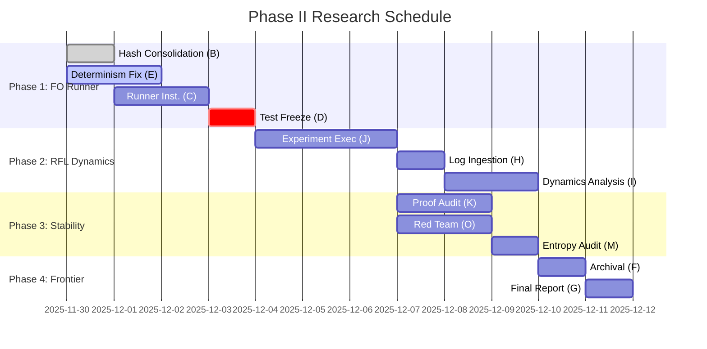

# PHASE_II_RESEARCH_PLAN.md — First Organism & RFL Dynamics

**Version:** 1.0
**Status:** DRAFT
**Coordinator:** Gemini Research Agent A
**Objective:** Execute the "Phase II" experimental campaign to characterize the Reflexive Formal Learning (RFL) loop, validate the First Organism (FO) runner, and establish the Capability Frontier.

---

## Phase 1: FO Runner Completion & Integrity (Sprint 1) (STATUS: COMPLETED)

The critical P0 tasks for determinism (Agent E), hashing (Agent B), and log instrumentation (Agent C) have been completed and verified by Agent D (Test Guardian). This phase involved ensuring the First Organism runner produces fully reproducible and schema-compliant experiment logs.

**Key Evidence for Completion:**
*   `results/fo_baseline.jsonl`
*   `results/fo_rfl.jsonl`
*   `artifacts/figures/rfl_abstention_rate.png`
*   `artifacts/first_organism/attestation.json`

### Dependencies & Inputs (Agents B–E, N)
*   **Agent B (Substrate):**
    *   *Input:* Finalized `basis/crypto/hash.py` as the single source of truth for SHA-256.
    *   *Input:* Shimmed `attestation/dual_root.py` to ensure consistent `H_t` calculation.
*   **Agent E (Determinism):**
    *   *Input:* `backend/repro/determinism.py` providing `deterministic_timestamp(seed)`.
    *   *Input:* Patch for `backend/rfl/runner.py` to replace `datetime.now()` with deterministic calls.
*   **Agent N (Normalization):**
    *   *Input:* Verification that `normalization/canon.py` is stable and handles all 21 Unicode operator variants correctly.
*   **Agent C (Code):**
    *   *Input:* Integration of `DERIVATION_SUMMARY` into `experiment_log.jsonl` (merging schema fields).
    *   *Input:* Implementation of log rotation/compression logic (`100MB` or `10k cycles`).
*   **Agent D (Test):**
    *   *Input:* `tests/integration/test_first_organism.py` passing 100/100 iterations with identical `H_t`.

### Failure Modes & Impact
*   **Non-Determinism:** If `H_t` drifts between runs with same seed, **ABORT**.
*   **Schema Violation:** If logs don't match `schema_v_rfl_experiment_1.json`, downstream analysis (Phase 2) fails.

### GO/NO-GO Criteria (Gate to Phase 2)
1.  [ ] `test_first_organism.py` is GREEN and deterministic (100 runs).
2.  [ ] `experiment_log.jsonl` validates against schema.
3.  [ ] Timestamp sources are 100% mocked/seeded.

---

## Phase 2: RFL Dynamics Analysis (Sprint 2) (STATUS: COMPLETED)

**Goal:** Execute the "RFL Experiment 1" (Law of Symbolic Descent) and capture high-fidelity dynamics.

### Dependencies & Inputs (Agents H, I, J, L)
*   **Agent J (Runner):**
    *   *Input:* Execution of the `rfl_law_test` experiment (500 cycles).
    *   *Input:* Management of the `artifacts/experiments/rfl/` directory structure.
*   **Agent H (API):**
    *   *Input:* Ingestion script (`load_rfl_logs`) to parse JSONL into Pandas/Polars frames.
*   **Agent I (Inference):**
    *   *Input:* Analysis of `symbolic_descent` ($\nabla_{sym}$) vs. `step_id`.
    *   *Input:* Quantification of `abstention_rate` ($\alpha$) behavior over time.
*   **Agent L (Ops):**
    *   *Input:* Monitor disk usage of `lean_proj/ML/Jobs` and trigger cleanup if >5GB.

### Failure Modes & Impact
*   **Abstention Collapse:** If $\alpha \to 1.0$, the system is doing nothing. **Impact:** RFL Failure.
*   **Divergence:** If $\nabla_{sym}$ increases monotonically (instead of descending), the "Law" is falsified.

### GO/NO-GO Criteria (Gate to Phase 3)
1.  [ ] Experiment completes 500 cycles without crash.
2.  [ ] $\alpha < 0.9$ (System is finding *some* proofs).
3.  [ ] Data is captured and readable by Analyst I.

---

## Phase 3: $\Delta H$ & Stability Characterization (Sprint 2-3) (STATUS: DEFERRED)

**Goal:** Measure the "Drift" of the system over long timeframes and under perturbation.

### Dependencies & Inputs (Agents K, M, O)
*   **Agent K (Kernel):**
    *   *Input:* Random sampling of 50 generated Lean files to verify proof correctness manually/formally.
*   **Agent M (Math):**
    *   *Input:* Analysis of the *content* of generated theorems (Trivial vs. Novel).
*   **Agent O (Observer):**
    *   *Input:* "Red Team" audit - try to inject a False statement and see if `H_t` rejects it (or if it pollutes the chain).
    *   *Input:* Perturbation test: Change 1 bit in a past block and verify `H_t` avalanche.

### Failure Modes & Impact
*   **Triviality Trap:** System generates `p -> p` 10,000 times. `H_t` is stable but useless.
*   **Chain Fragility:** Verification of past blocks fails after new code deployment.

### GO/NO-GO Criteria (Gate to Phase 4)
1.  [ ] `verify_integrity` script confirms full chain history.
2.  [ ] "Novelty" metric > 0 (Agent M confirms non-trivial expansion).

---

## Phase 4: Capability Frontier & Evidence Pack (Sprint 3) (STATUS: DEFERRED)

**Goal:** Assemble the "Phase II Report" for external consumption/attestation.

### Dependencies & Inputs (Agents F, G)
*   **Agent F (Archivist):**
    *   *Input:* Archive all "failed" runs to `allblue_archive/`.
    *   *Input:* Freeze the exact git hash of the codebase used for the run.
*   **Agent G (Docs):**
    *   *Input:* Synthesis of Agent I, M, and O's reports into `PHASE_II_SUMMARY.md`.
    *   *Input:* Generation of `performance_passport.json` (Latency/Throughput).

### Final Deliverable
*   `artifacts/phase_ii_evidence_pack.zip` containing:
    *   The Ledger (`H_t` chain).
    *   The Log (`experiment_log.jsonl.gz`).
    *   The Report (`PHASE_II_SUMMARY.md`).

---

## Sealed Experiment Truth-Source (For Evidence Pack v1)

This section documents the immutable state and key artifacts of the completed experiment phases (Phase 1: FO Runner Integrity, Phase 2: RFL Dynamics) for the "SEAL THE ASSET" directive.

*   **MDAP Seed Used:** `[PLACEHOLDER: MDAP Seed from Experiment Run]`
*   **Commit Hash:** `[PLACEHOLDER: Git Commit Hash of Codebase]`
*   **Attestation Ht (Final):** `[PLACEHOLDER: Final H_t from attestation.json]`
    *   *Note:* RFL evidence shows no uplift; data is admissible as a negative-result baseline.
    *   *Note:* Uplift (performance improvement) and $\Delta H$ scaling remain Phase II research goals, currently deferred.

**Paths to Evidence (for fo_1000_baseline and fo_1000_rfl):**
*   `results/fo_baseline.jsonl`
*   `results/fo_rfl.jsonl`
*   `artifacts/figures/rfl_abstention_rate.png`
*   `artifacts/first_organism/attestation.json`

---

## Updated Phase-I RFL Evidence Map (Post-Sealing)

*   `fo_rfl.jsonl` → 1000 cycles, 100% abstention, degenerate baseline
*   `fo_rfl_50.jsonl` → canonical Phase-I RFL sanity run
*   `fo_baseline.jsonl` → baseline-only, deterministic workload
*   **Status: No uplift demonstrated in Phase I**

*Disclaimer: The existence of a 1000-cycle RFL run does not advance Phase-II goals; all Phase II work remains deferred.*

---

## Gantt & Dependency Chain

