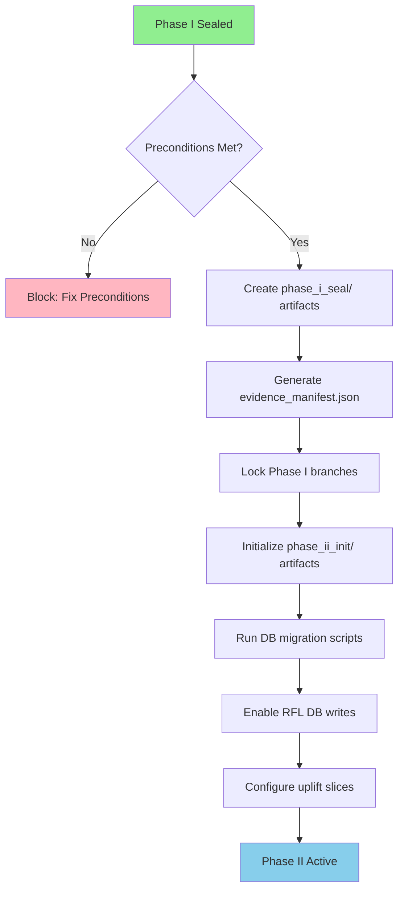
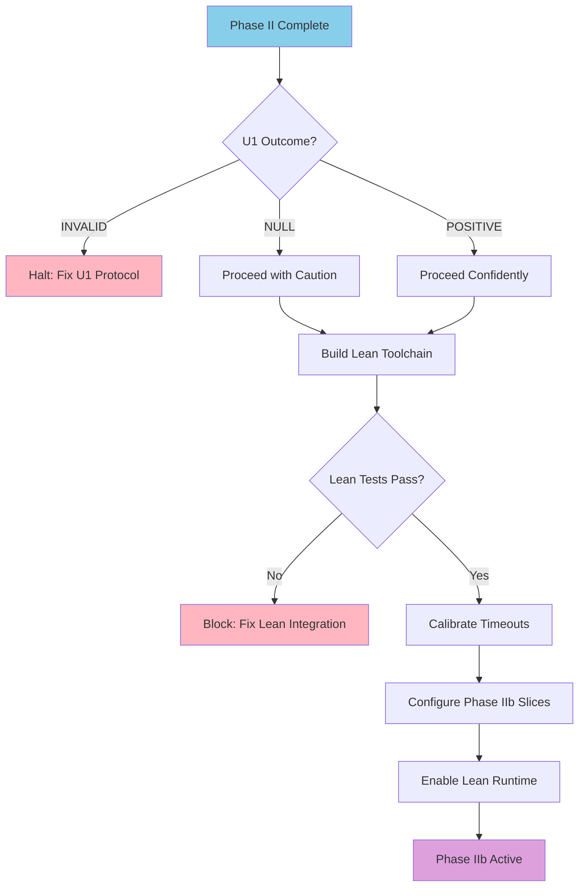
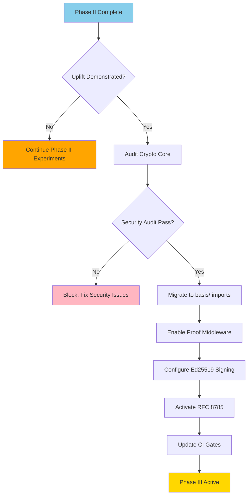

# Phase Migration Guide — MathLedger Inter-Phase Constitution

**Version:** 1.0.0  
**Status:** Canonical Specification  
**Author:** Agent `doc-ops-4` — Migration Architect  
**Date:** 2025-12-06  
**Authority:** Governance Council, VCP 2.3

---

## ABSOLUTE SAFEGUARDS

> **These safeguards are inviolable during any phase transition:**
>
> - ❌ **No mutations to Phase I behavior** — Phase I evidence is sealed
> - ❌ **No reinterpretation of Phase I evidence** — Facts are immutable
> - ❌ **No governance law changes** — Existing contracts remain binding

---

## Table of Contents

1. [Overview](#1-overview)
2. [Phase Definitions](#2-phase-definitions)
3. [Migration Pathway: Phase I → Phase II](#3-migration-pathway-phase-i--phase-ii)
4. [Migration Pathway: Phase II → Phase IIb](#4-migration-pathway-phase-ii--phase-iib)
5. [Migration Pathway: Phase II → Phase III](#5-migration-pathway-phase-ii--phase-iii)
6. [Migration Diagrams](#6-migration-diagrams)
7. [CI Integration Notes](#7-ci-integration-notes)
8. [Security Model Elevation Matrix](#8-security-model-elevation-matrix)
9. [Audit & Verification Protocol](#9-audit--verification-protocol)

---

## 1. Overview

MathLedger operates in a multi-phase architecture where each phase adds capabilities while preserving the integrity of prior phases. This document defines the **official migration pathways** across phases, serving as the inter-phase constitution.

### 1.1 Core Principles

```
┌─────────────────────────────────────────────────────────────────────┐
│                    MIGRATION PRINCIPLES                              │
├─────────────────────────────────────────────────────────────────────┤
│ 1. MONOTONIC PROGRESSION — No rollbacks to lower phases             │
│ 2. SEALED EVIDENCE — Prior phase artifacts are immutable            │
│ 3. DETERMINISM CONTINUITY — H_t computation must remain consistent  │
│ 4. SECURITY ELEVATION — Each phase adds security, never removes     │
│ 5. SEED LINEAGE — Seed schedules preserve reproducibility           │
└─────────────────────────────────────────────────────────────────────┘
```

### 1.2 Document Scope

| Transition | Source | Target | Status |
|------------|--------|--------|--------|
| **Uplift** | Phase I | Phase II | Primary pathway |
| **Lean-Enable** | Phase II | Phase IIb | Verification upgrade |
| **Generalize** | Phase II | Phase III | Architecture hardening |

---

## 2. Phase Definitions

### 2.1 Phase I — Infrastructure Validation

**Codename:** First Organism Plumbing  
**Status:** SEALED (Evidence Pack v1)

| Attribute | Value |
|-----------|-------|
| **Verifier** | Truth-table (Lean-disabled) |
| **Evidence Storage** | File-based (JSONL) |
| **DB Writes** | Hermetic (none) |
| **Abstention Profile** | 100% (negative control) |
| **RFL Mode** | Infrastructure validation only |
| **Determinism** | Proven via `test_first_organism_determinism.py` |

**Canonical Evidence:**
- `results/fo_baseline.jsonl` (1000 cycles)
- `results/fo_rfl.jsonl` (1001 cycles)
- `artifacts/first_organism/attestation.json`

### 2.2 Phase II — RFL Uplift Experiments

**Codename:** Asymmetric Verification  
**Status:** DEFINED (Not Yet Run)

| Attribute | Value |
|-----------|-------|
| **Verifier** | Truth-table (active) |
| **Evidence Storage** | DB-backed + JSONL |
| **DB Writes** | Enabled |
| **Abstention Profile** | Target 5-40% (non-degenerate) |
| **RFL Mode** | Policy learning enabled |
| **Determinism** | Seed-controlled reproduction |

**Key Components:**
- U2 experiment family (`slice_uplift_*`)
- Preregistration required (`PREREG_UPLIFT_U2.yaml`)
- Statistical significance gates

### 2.3 Phase IIb — Lean-Enabled Verification

**Codename:** Formal Verification Upgrade  
**Status:** DEFERRED (Blocked on U1 completion)

| Attribute | Value |
|-----------|-------|
| **Verifier** | Lean 4 runtime |
| **Lean Timeout** | 2-5 seconds per proof |
| **Target Slices** | `slice_pl_uplift_a/b/c` |
| **Abstention Profile** | Target 20-70% |
| **Prerequisites** | U1 experiment complete |

### 2.4 Phase III — Generalized Asymmetry

**Codename:** Crypto Hardening  
**Status:** ARCHITECTURE COMPLETE (Implementation Partial)

| Attribute | Value |
|-----------|-------|
| **Signatures** | Ed25519 |
| **Canonicalization** | RFC 8785 |
| **Middleware** | Proof-of-Execution |
| **Package** | `basis/` consolidation |

---

## 3. Migration Pathway: Phase I → Phase II

### 3.1 Preconditions

Before initiating Phase I → Phase II transition:

| ID | Precondition | Verification Method |
|----|--------------|---------------------|
| **P1-01** | Phase I evidence sealed | `attestation.json` exists with valid H_t |
| **P1-02** | Determinism tests pass | `pytest tests/integration/test_first_organism_determinism.py` |
| **P1-03** | 1000+ cycle baseline exists | `results/fo_baseline.jsonl` line count ≥ 1000 |
| **P1-04** | RFL plumbing validated | `fo_rfl.jsonl` produces consistent H_t on replay |
| **P1-05** | No pending Phase I PRs | GitHub PR review queue empty for Phase I branches |

### 3.2 Required Artifacts

```
artifacts/
├── phase_i_seal/
│   ├── evidence_manifest.json      # Hash of all Phase I evidence
│   ├── attestation_snapshot.json   # Final H_t from Phase I
│   ├── determinism_proof.log       # Test output proving determinism
│   └── config_hash.sha256          # Hash of curriculum.yaml at seal time
└── phase_ii_init/
    ├── PREREG_UPLIFT_U2.yaml       # Preregistration document
    ├── curriculum_uplift_phase2.yaml
    └── baseline_seed_schedule.json # Deterministic seeds for experiments
```

### 3.3 Mode-Switch Procedure



**Step-by-Step:**

1. **Seal Phase I Evidence**
   ```powershell
   # Create manifest of all Phase I evidence
   python scripts/seal_phase_evidence.py --phase=1 --output=artifacts/phase_i_seal/
   ```

2. **Verify Determinism Continuity**
   ```powershell
   # Run determinism check with Phase I seed
   uv run pytest tests/integration/test_first_organism_determinism.py -v
   ```

3. **Initialize Phase II Database**
   ```powershell
   # Run Phase II migrations
   uv run python scripts/run-migrations.py --phase=2
   ```

4. **Activate Uplift Configuration**
   ```yaml
   # In config/curriculum.yaml, change:
   active: slice_hard  # Phase I
   # To:
   active: slice_uplift_goal  # Phase II
   ```

5. **Enable DB-backed RFL**
   ```python
   # In rfl/config.py, set:
   RFL_DB_ENABLED = True  # Was False in Phase I
   ```

### 3.4 Determinism Checks

| Check ID | Description | Command |
|----------|-------------|---------|
| **D1-01** | H_t recomputation | `python tools/verify_ht_recomputable.py --attestation=artifacts/phase_i_seal/attestation_snapshot.json` |
| **D1-02** | Seed continuity | `python tools/verify_seed_lineage.py --from=phase1 --to=phase2` |
| **D1-03** | Normalization stability | `pytest tests/test_canon.py -v` |
| **D1-04** | Hash contract | `pytest tests/test_hash_canonization.py -v` |

### 3.5 Seed Continuity Requirements

```python
# Seed schedule must be deterministic and documented
PHASE_II_SEED_SCHEDULE = {
    "baseline_seed": 42,           # Same as Phase I for comparability
    "rfl_seed": 42,                # Paired with baseline
    "experiment_seeds": [
        {"slice": "slice_uplift_goal", "seed": 1001},
        {"slice": "slice_uplift_sparse", "seed": 1002},
        {"slice": "slice_uplift_tree", "seed": 1003},
        {"slice": "slice_uplift_dependency", "seed": 1004},
    ]
}
```

### 3.6 Security Model Elevation

| Security Aspect | Phase I | Phase II |
|-----------------|---------|----------|
| **Secrets** | `.env.first_organism` template | Production secrets required |
| **DB Auth** | None (hermetic) | SCRAM-SHA-256 |
| **Redis Auth** | None (hermetic) | Password protected |
| **API Keys** | Optional | Required (`LEDGER_API_KEY`) |
| **CORS** | Permissive | Explicit origins only |

---

## 4. Migration Pathway: Phase II → Phase IIb

### 4.1 Preconditions

| ID | Precondition | Verification Method |
|----|--------------|---------------------|
| **P2b-01** | U1 experiment complete | `results/uplift_u1/` directory exists |
| **P2b-02** | U1 outcome analyzed | `statistical_summary.json` with verdict |
| **P2b-03** | Lean toolchain built | `backend/lean_proj/build/` exists |
| **P2b-04** | Lean tests pass | `pytest tests/test_lean_interface.py` |
| **P2b-05** | Timeout calibration | `lean_timeout_ms` benchmarked |

### 4.2 Required Artifacts

```
artifacts/
├── phase_ii_evidence/
│   ├── u1_baseline.jsonl
│   ├── u1_rfl.jsonl
│   ├── u1_manifest.json
│   └── u1_statistical_summary.json
└── phase_iib_init/
    ├── lean_build_manifest.json
    ├── timeout_calibration.json
    └── uplift_slice_configs/
        ├── slice_pl_uplift_a.yaml
        ├── slice_pl_uplift_b.yaml
        └── slice_pl_uplift_c.yaml
```

### 4.3 Mode-Switch Procedure



**Step-by-Step:**

1. **Analyze U1 Outcome**
   ```powershell
   python experiments/analyze_u1.py --input=results/uplift_u1/
   # Outputs: INVALID | NULL | POSITIVE
   ```

2. **Build Lean Toolchain**
   ```powershell
   cd backend/lean_proj
   lake build
   ```

3. **Calibrate Timeouts**
   ```powershell
   python tools/calibrate_lean_timeout.py --samples=100
   # Outputs timeout_calibration.json
   ```

4. **Enable Lean Verification**
   ```python
   # In slice config:
   lean_enabled: true
   lean_timeout_ms: 5000  # From calibration
   ```

### 4.4 Determinism Checks

| Check ID | Description | Command |
|----------|-------------|---------|
| **D2b-01** | Lean output determinism | `python tools/verify_lean_determinism.py --runs=10` |
| **D2b-02** | Timeout handling consistency | `pytest tests/test_lean_timeout_behavior.py` |
| **D2b-03** | Abstention categorization | `pytest tests/test_abstention_categories.py` |

### 4.5 Seed Continuity Requirements

```python
# Phase IIb must use consistent seed strategy
PHASE_IIB_SEED_SCHEDULE = {
    # Inherit from Phase II
    "baseline_seed": 42,
    # New Lean-enabled experiments
    "lean_experiment_seeds": [
        {"slice": "slice_pl_uplift_a", "seed": 2001},
        {"slice": "slice_pl_uplift_b", "seed": 2002},
        {"slice": "slice_pl_uplift_c", "seed": 2003},
    ]
}
```

---

## 5. Migration Pathway: Phase II → Phase III

### 5.1 Preconditions

| ID | Precondition | Verification Method |
|----|--------------|---------------------|
| **P3-01** | Phase II uplift measured | At least one U2 slice shows Δp ≥ 0.05 |
| **P3-02** | Crypto core implemented | `backend/crypto/core.py` exists |
| **P3-03** | RFC 8785 compliance | `tests/test_rfc8785.py` passes |
| **P3-04** | Ed25519 key management | Key generation tested |
| **P3-05** | Proof middleware ready | `proof_middleware.py` implemented |

### 5.2 Required Artifacts

```
artifacts/
├── phase_ii_evidence/
│   └── uplift_summary.json
└── phase_iii_init/
    ├── crypto_core_audit.md
    ├── key_rotation_policy.md
    ├── proof_middleware_config.yaml
    └── basis_migration_checklist.md
```

### 5.3 Mode-Switch Procedure



**Step-by-Step:**

1. **Run Security Audit**
   ```powershell
   python scripts/phase3_validation.py
   python scripts/verify_proof_pipeline.py --verify-all
   ```

2. **Migrate Imports to basis/**
   ```python
   # Old (Phase II):
   from normalization.canon import normalize
   from attestation.dual_root import composite_root
   
   # New (Phase III):
   from basis.logic.normalizer import normalize
   from basis.attestation.dual import composite_root
   ```

3. **Enable Proof Middleware**
   ```python
   # In backend/orchestrator/app.py:
   from backend.orchestrator.proof_middleware import ProofMiddleware
   app.add_middleware(ProofMiddleware)
   ```

4. **Configure Ed25519 Signing**
   ```yaml
   # In config/security.yaml:
   signing:
     algorithm: ed25519
     key_rotation_days: 90
     require_signatures: true
   ```

5. **Activate RFC 8785 Canonicalization**
   ```python
   # All JSON output uses:
   from basis.crypto.json import rfc8785_canonicalize
   ```

### 5.4 Determinism Checks

| Check ID | Description | Command |
|----------|-------------|---------|
| **D3-01** | basis/ import purity | `python tools/verify_basis_purity.py` |
| **D3-02** | RFC 8785 determinism | `pytest tests/test_rfc8785_determinism.py` |
| **D3-03** | Signature verification | `pytest tests/test_ed25519_signatures.py` |
| **D3-04** | Proof middleware replay | `pytest tests/test_proof_middleware_determinism.py` |

### 5.5 Security Model Elevation

| Security Aspect | Phase II | Phase III |
|-----------------|----------|-----------|
| **Canonicalization** | Ad-hoc JSON | RFC 8785 strict |
| **Signatures** | None | Ed25519 on all proofs |
| **Audit Trail** | Log files | Append-only proof ledger |
| **Key Management** | N/A | Rotation policy required |
| **Middleware** | None | Proof-of-Execution |

---

## 6. Migration Diagrams

### 6.1 Complete Phase Dependency Chain

```
┌─────────────────────────────────────────────────────────────────────────────┐
│                        MATHLEDGER PHASE ARCHITECTURE                         │
└─────────────────────────────────────────────────────────────────────────────┘

                              ┌─────────────────┐
                              │    PHASE I      │
                              │  Infrastructure │
                              │   Validation    │
                              │                 │
                              │ • Hermetic      │
                              │ • Lean-disabled │
                              │ • 100% abstain  │
                              │ • JSONL only    │
                              └────────┬────────┘
                                       │
                    ┌──────────────────┴──────────────────┐
                    │         UPLIFT GATE                  │
                    │  • Determinism proven                │
                    │  • 1000+ cycles complete             │
                    │  • Evidence sealed                   │
                    └──────────────────┬──────────────────┘
                                       │
                              ┌────────▼────────┐
                              │    PHASE II     │
                              │  RFL Uplift     │
                              │  Experiments    │
                              │                 │
                              │ • DB-backed     │
                              │ • Truth-table   │
                              │ • 5-40% abstain │
                              │ • U2 slices     │
                              └────────┬────────┘
                                       │
                    ┌──────────────────┼──────────────────┐
                    │                  │                   │
           ┌────────▼────────┐        │          ┌────────▼────────┐
           │   PHASE IIb     │        │          │   PHASE III     │
           │  Lean-Enabled   │        │          │  Generalized    │
           │  Verification   │        │          │  Asymmetry      │
           │                 │        │          │                 │
           │ • Lean runtime  │        │          │ • Ed25519       │
           │ • 2-5s timeout  │        │          │ • RFC 8785      │
           │ • 20-70% abstain│        │          │ • basis/ pkg    │
           │ • Formal proofs │        │          │ • Proof MW      │
           └─────────────────┘        │          └─────────────────┘
                                      │
                             ┌────────▼────────┐
                             │   PHASE IV      │
                             │   (Future)      │
                             │  Production     │
                             │  Deployment     │
                             └─────────────────┘
```

### 6.2 Gate Sequencing Diagram

```mermaid
flowchart LR
    subgraph Phase_I [Phase I - SEALED]
        FO[First Organism]
        DET[Determinism Test]
        ATT[Attestation]
    end
    
    subgraph Gates_I_II [Phase I → II Gates]
        G1[Evidence Sealed]
        G2[1000+ Cycles]
        G3[Determinism Proven]
    end
    
    subgraph Phase_II [Phase II]
        U2[U2 Experiments]
        STAT[Statistical Analysis]
        DB[DB-backed RFL]
    end
    
    subgraph Gates_II_IIb [Phase II → IIb Gates]
        G4[U1 Complete]
        G5[Lean Built]
        G6[Timeout Calibrated]
    end
    
    subgraph Phase_IIb [Phase IIb]
        LEAN[Lean Verification]
        FORM[Formal Proofs]
    end
    
    subgraph Gates_II_III [Phase II → III Gates]
        G7[Uplift Measured]
        G8[Crypto Audited]
        G9[basis/ Ready]
    end
    
    subgraph Phase_III [Phase III]
        CRYPTO[Crypto Hardening]
        MW[Proof Middleware]
        BASIS[basis/ Package]
    end
    
    FO --> DET --> ATT
    ATT --> G1 --> G2 --> G3
    G3 --> U2 --> STAT --> DB
    DB --> G4 --> G5 --> G6
    G6 --> LEAN --> FORM
    DB --> G7 --> G8 --> G9
    G9 --> CRYPTO --> MW --> BASIS
```



### 6.3 Artifact Flow Diagram

```
┌─────────────────────────────────────────────────────────────────────────┐
│                         ARTIFACT FLOW ACROSS PHASES                      │
└─────────────────────────────────────────────────────────────────────────┘

PHASE I                          PHASE II                      PHASE III
─────────────────────────────────────────────────────────────────────────────
                                                              
fo_baseline.jsonl ───────────────┐                            
                                 │                            
fo_rfl.jsonl ────────────────────┼──► uplift_u2_*.jsonl ─────► proof_ledger.jsonl
                                 │                            
attestation.json ────────────────┼──► experiment_manifest.json─► signed_manifest.json
                                 │                            
config/curriculum.yaml ──────────┴──► curriculum_uplift_phase2.yaml
                                                              
determinism_proof.log ───────────────► seed_lineage.json ────► proof_chain.json
                                                              
                                      statistical_summary.json─► audit_report.json
```

---

## 7. CI Integration Notes

### 7.1 Workflow Applicability Matrix

| Workflow | Phase I | Phase II | Phase IIb | Phase III |
|----------|---------|----------|-----------|-----------|
| `ci.yml` | ✅ | ✅ | ✅ | ✅ |
| `determinism-gate.yml` | ✅ | ✅ | ✅ | ✅ |
| `dual-attestation.yml` | ✅ | ✅ | ✅ | ✅ |
| `evidence-gate.yml` | ✅ | ✅ | ✅ | ✅ |
| `uplift-eval.yml` | ❌ | ✅ | ✅ | ✅ |
| `veracity-gate.yml` | ❌ | ✅ | ✅ | ✅ |
| `performance-sanity.yml` | ✅ | ✅ | ✅ | ✅ |

### 7.2 Phase Boundary Violation Detection

A **Phase Boundary Violation** occurs when:

| Violation Type | Description | Detection |
|----------------|-------------|-----------|
| **V1: Premature DB Write** | Phase I code writes to DB | `grep -r "session.commit\|db.add" backend/` in Phase I |
| **V2: Lean in Phase I** | Lean runtime called in Phase I | `lean_enabled: true` in Phase I config |
| **V3: Missing Preregistration** | Phase II experiment without prereg | `PREREG_*.yaml` not found before experiment |
| **V4: Signature Skip** | Phase III without Ed25519 | `require_signatures: false` in Phase III |
| **V5: basis/ Import Leak** | Economy layer imports basis/ in Phase I | Import graph analysis |

### 7.3 CI Gate Configuration

```yaml
# .github/workflows/phase-gate.yml
name: Phase Boundary Gate

on:
  pull_request:
    paths:
      - 'backend/**'
      - 'rfl/**'
      - 'basis/**'
      - 'config/**'

jobs:
  phase-check:
    runs-on: ubuntu-latest
    steps:
      - uses: actions/checkout@v4
      
      - name: Detect Current Phase
        id: phase
        run: |
          PHASE=$(python tools/detect_phase.py)
          echo "phase=$PHASE" >> $GITHUB_OUTPUT
      
      - name: Check Phase I Constraints
        if: steps.phase.outputs.phase == '1'
        run: |
          # No DB writes allowed
          ! grep -r "session.commit" backend/
          # Lean must be disabled
          grep "lean_enabled: false" config/curriculum.yaml
      
      - name: Check Phase II Constraints
        if: steps.phase.outputs.phase == '2'
        run: |
          # Preregistration must exist for experiments
          test -f experiments/prereg/PREREG_UPLIFT_U2.yaml
      
      - name: Check Phase III Constraints
        if: steps.phase.outputs.phase == '3'
        run: |
          # basis/ imports must be pure
          python tools/verify_basis_purity.py
          # Signatures required
          grep "require_signatures: true" config/security.yaml
```

### 7.4 PR Review Checklist by Phase

#### Phase I → Phase II PRs

- [ ] Phase I evidence manifest exists and is sealed
- [ ] Determinism test output attached
- [ ] DB migration scripts included
- [ ] Preregistration document committed
- [ ] Seed schedule documented

#### Phase II → Phase IIb PRs

- [ ] U1 experiment results attached
- [ ] Lean build artifacts included
- [ ] Timeout calibration report attached
- [ ] New slice configurations validated

#### Phase II → Phase III PRs

- [ ] Uplift statistical summary attached
- [ ] Security audit report included
- [ ] basis/ migration diff attached
- [ ] Proof middleware test coverage ≥ 80%

---

## 8. Security Model Elevation Matrix

### 8.1 Complete Security Comparison

| Security Domain | Phase I | Phase II | Phase IIb | Phase III |
|-----------------|---------|----------|-----------|-----------|
| **Authentication** |
| Database Auth | None (hermetic) | SCRAM-SHA-256 | SCRAM-SHA-256 | SCRAM-SHA-256 + mTLS |
| Redis Auth | None (hermetic) | Password | Password | Password + TLS |
| API Auth | Optional | Required | Required | Required + Signature |
| **Cryptography** |
| Hashing | SHA-256 | SHA-256 | SHA-256 | SHA-256 + HMAC |
| Signatures | None | None | None | Ed25519 |
| Canonicalization | Ad-hoc | Ad-hoc | Ad-hoc | RFC 8785 |
| **Attestation** |
| Dual-Root | Yes | Yes | Yes | Yes + Signed |
| Proof Chain | File-based | DB-backed | DB-backed | Append-only ledger |
| Tamper Detection | Hash verification | Hash verification | Hash verification | Signature verification |
| **Access Control** |
| CORS | Permissive | Explicit origins | Explicit origins | Strict origins |
| Rate Limiting | None | Optional | Optional | Required |
| Request Size | Unlimited | Limited | Limited | Limited |

### 8.2 Secret Management Evolution

```
Phase I:  .env.first_organism (template only, hermetic execution)
              │
              ▼
Phase II: .env.production (real secrets, encrypted at rest)
              │
              ▼
Phase IIb: Same as Phase II + Lean runtime secrets
              │
              ▼
Phase III: Vault/HSM integration + Key rotation policy
```

---

## 9. Audit & Verification Protocol

### 9.1 Pre-Migration Audit Checklist

```
┌─────────────────────────────────────────────────────────────────────────┐
│                    PRE-MIGRATION AUDIT CHECKLIST                         │
├─────────────────────────────────────────────────────────────────────────┤
│                                                                          │
│  □ 1. All preconditions documented and verified                         │
│  □ 2. Required artifacts generated and committed                        │
│  □ 3. Determinism checks pass (100% success rate)                       │
│  □ 4. Seed continuity verified                                          │
│  □ 5. Security model elevation documented                               │
│  □ 6. CI gates configured for target phase                              │
│  □ 7. Rollback procedure documented                                     │
│  □ 8. Team sign-off obtained                                            │
│                                                                          │
└─────────────────────────────────────────────────────────────────────────┘
```

### 9.2 Post-Migration Verification

```powershell
# Run after any phase migration
# Phase I → II
uv run pytest tests/integration/test_first_organism.py -v
uv run pytest tests/integration/test_first_organism_determinism.py -v
python tools/verify_seed_lineage.py --from=1 --to=2

# Phase II → IIb
uv run pytest tests/test_lean_interface.py -v
python tools/verify_lean_determinism.py --runs=5

# Phase II → III
python scripts/phase3_validation.py
python scripts/verify_proof_pipeline.py --verify-all
python tools/verify_basis_purity.py
```

### 9.3 Rollback Procedures

#### Phase II → Phase I Rollback

```powershell
# 1. Disable DB writes
# In rfl/config.py:
# RFL_DB_ENABLED = False

# 2. Revert curriculum config
git checkout HEAD~1 -- config/curriculum.yaml

# 3. Drop Phase II tables (if created)
# python scripts/rollback_phase2_migrations.py

# 4. Verify Phase I operation
uv run pytest tests/integration/test_first_organism.py -v
```

#### Phase IIb → Phase II Rollback

```powershell
# 1. Disable Lean runtime
# In slice configs:
# lean_enabled: false

# 2. Revert to truth-table verification
git checkout HEAD~1 -- config/curriculum_uplift_phase2.yaml

# 3. Verify Phase II operation
uv run pytest tests/integration/test_uplift_u2.py -v
```

#### Phase III → Phase II Rollback

```powershell
# 1. Disable proof middleware
# Remove ProofMiddleware from app.py

# 2. Revert imports to transitional modules
# basis/ → normalization/, attestation/

# 3. Disable signature requirements
# require_signatures: false

# 4. Verify Phase II operation
uv run pytest tests/ -v
```

---

## Appendix A: Quick Reference Cards

### A.1 Phase I → II Quick Reference

```
┌─────────────────────────────────────────────────────────┐
│         PHASE I → PHASE II QUICK REFERENCE              │
├─────────────────────────────────────────────────────────┤
│ PRECONDITIONS:                                          │
│   ✓ attestation.json exists                             │
│   ✓ determinism test passes                             │
│   ✓ 1000+ cycles complete                               │
│                                                          │
│ KEY CHANGES:                                            │
│   hermetic → DB-backed                                  │
│   lean-disabled → truth-table (same)                    │
│   100% abstain → 5-40% target                           │
│   fo_*.jsonl → uplift_u2_*.jsonl                        │
│                                                          │
│ COMMANDS:                                               │
│   python scripts/seal_phase_evidence.py --phase=1       │
│   python scripts/run-migrations.py --phase=2            │
│   pytest tests/integration/ -v                          │
└─────────────────────────────────────────────────────────┘
```

### A.2 Phase II → IIb Quick Reference

```
┌─────────────────────────────────────────────────────────┐
│         PHASE II → PHASE IIb QUICK REFERENCE            │
├─────────────────────────────────────────────────────────┤
│ PRECONDITIONS:                                          │
│   ✓ U1 experiment complete                              │
│   ✓ Lean toolchain built                                │
│   ✓ Timeout calibrated                                  │
│                                                          │
│ KEY CHANGES:                                            │
│   truth-table → Lean runtime                            │
│   5-40% abstain → 20-70% target                         │
│   U2 slices → uplift_a/b/c slices                       │
│                                                          │
│ COMMANDS:                                               │
│   cd backend/lean_proj && lake build                    │
│   python tools/calibrate_lean_timeout.py                │
│   pytest tests/test_lean_interface.py -v                │
└─────────────────────────────────────────────────────────┘
```

### A.3 Phase II → III Quick Reference

```
┌─────────────────────────────────────────────────────────┐
│         PHASE II → PHASE III QUICK REFERENCE            │
├─────────────────────────────────────────────────────────┤
│ PRECONDITIONS:                                          │
│   ✓ Uplift demonstrated (Δp ≥ 0.05)                     │
│   ✓ Crypto core audited                                 │
│   ✓ basis/ imports ready                                │
│                                                          │
│ KEY CHANGES:                                            │
│   ad-hoc JSON → RFC 8785                                │
│   no signatures → Ed25519                               │
│   transitional → basis/ imports                         │
│   log files → proof ledger                              │
│                                                          │
│ COMMANDS:                                               │
│   python scripts/phase3_validation.py                   │
│   python scripts/verify_proof_pipeline.py --verify-all  │
│   python tools/verify_basis_purity.py                   │
└─────────────────────────────────────────────────────────┘
```

---

## Document Control

| Field | Value |
|-------|-------|
| **Document ID** | `DOC-MIG-001` |
| **Version** | 1.0.0 |
| **Classification** | Internal — Governance |
| **Last Updated** | 2025-12-06 |
| **Next Review** | 2026-03-06 |
| **Owner** | Agent `doc-ops-4` |
| **Approvers** | Governance Council |

---

*This document serves as the official inter-phase constitution for MathLedger phase migrations. All phase transitions must comply with the procedures and gates defined herein.*

**— Agent `doc-ops-4`, Migration Architect**

