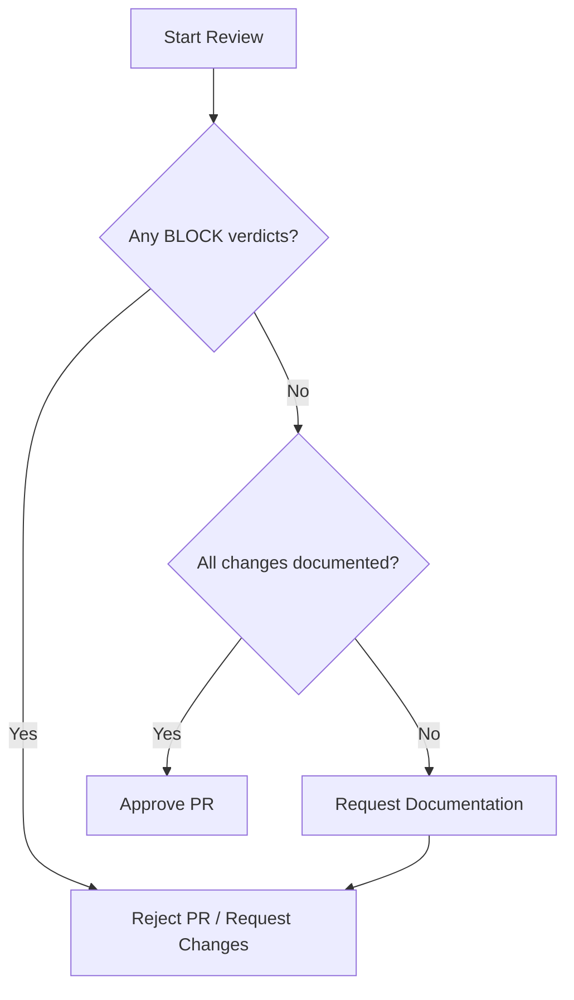

# Curriculum Diff Human Review Guide

**Document ID**: `CUR-DIFF-GUIDE-V1`  
**Author**: MANUS-E, Curriculum Integrity Engineer  
**Status**: OPERATIONAL  
**Date**: 2025-12-10

---

## 1. Purpose

This guide provides a one-page checklist for human reviewers (teachers, engineers, researchers) to quickly assess whether a curriculum diff is **benign** (safe to merge) or **blocking** (requires further investigation). This guide should be used during code reviews of any changes to `config/curriculum.yaml`.

**Tool**: `python -m backend.tools.curriculum_differ <old_config.yaml> <new_config.yaml> <slug>`

## 2. Review Checklist

### Step 1: Check for Structural Changes

**Look for**: `Structural Changes` section in the diff report.

- [ ] **Added Slices**: `Added slices: ['slice_new']`
  - **Question**: Is this a planned addition to the curriculum? Does it have a corresponding ticket or design document?
  - **Verdict**: **BLOCK** if unplanned. **BENIGN** if planned.

- [ ] **Removed Slices**: `Removed slices: ['slice_deprecated']`
  - **Question**: Is this a planned deprecation? What is the impact on agents currently on this slice?
  - **Verdict**: **BLOCK** if unplanned. **BENIGN** if planned and impact is understood.

- [ ] **Version Change**: `Version changed: 2 -> 3`
  - **Question**: Does this change correspond to a backward-incompatible change in the curriculum loader (`curriculum.py`)?
  - **Verdict**: **BLOCK** always. This is a high-ceremony event that requires a separate, dedicated review.

- [ ] **Invariants Change**: `Invariants changed: ...`
  - **Question**: Is this change to `monotonic_axes` or other system invariants intentional and understood?
  - **Verdict**: **BLOCK** if unplanned. **BENIGN** if planned.

### Step 2: Check for Gate Threshold Changes

**Look for**: `Gate Threshold Changes` section in the diff report.

- [ ] **Gate Easier**: `ci_lower_min: 0.85 -> 0.80` or `max_rate_pct: 25.0 -> 30.0`
  - **Question**: Why are we making it easier to pass this slice? Is this to unblock a stuck agent, or is it a permanent change to the definition of success?
  - **Verdict**: **BLOCK** if it is an un-documented change to the definition of success. **BENIGN** if it is a temporary, well-documented intervention.

- [ ] **Gate Harder**: `min_pph: 50.0 -> 60.0` or `sample_min: 30 -> 40`
  - **Question**: Why are we making it harder to pass this slice? Is this to improve the quality of agents that pass?
  - **Verdict**: **BENIGN** if intentional and documented. This is generally a safe change.

### Step 3: Check for Parameter Changes

**Look for**: `Parameter Changes` section in the diff report.

- [ ] **Problem Space Change**: `atoms: 5 -> 6` or `depth_max: 8 -> 9`
  - **Question**: Is this change intended to increase the difficulty of this slice? Is it consistent with the `monotonic_axes` invariants?
  - **Verdict**: **BLOCK** if it violates monotonicity. **BENIGN** if it is an intentional difficulty increase.

- [ ] **Resource Allocation Change**: `breadth_max: 1000 -> 1200` or `total_max: 5000 -> 6000`
  - **Question**: Does this change affect the computational resources required to solve this slice? 
  - **Verdict**: **BENIGN** if the resource change is minor and understood.

### Step 4: Check for Metadata Changes

**Look for**: Changes to non-functional parameters (not explicitly listed in the diff report, may need manual inspection).

- [ ] **Metadata-only Change**: e.g., `description`, `wave`, `ladder_position`
  - **Question**: Does this change affect any downstream tooling or dashboards?
  - **Verdict**: **BENIGN** if it is truly metadata-only. These changes should not alter the fingerprint.

---

## 3. Verdict Flowchart

## 4. Heuristics & Red Flags

- **Large, multi-slice changes**: A diff that touches many slices at once is high-risk. **BLOCK** and request that it be broken into smaller, more targeted changes.
- **Changes to completed slices**: Modifying a slice that is already marked as `completed_at` is highly suspicious. **BLOCK** and investigate why a completed slice is being altered.
- **Violation of monotonicity**: If a parameter listed in `monotonic_axes` decreases in a later slice, this is a critical error. The `_validate_monotonicity()` check should catch this, but it is good practice to verify manually. **BLOCK** immediately.
- **Undocumented "magic numbers"**: If a gate threshold or parameter is changed to a seemingly arbitrary number without explanation, **BLOCK** and ask for the derivation or rationale.

**Golden Rule**: If you do not understand the purpose and impact of a change, **BLOCK** it. It is always safer to ask for clarification than to approve a change that could invalidate weeks later invalidates a multi-thousand dollar-compute experiments.
